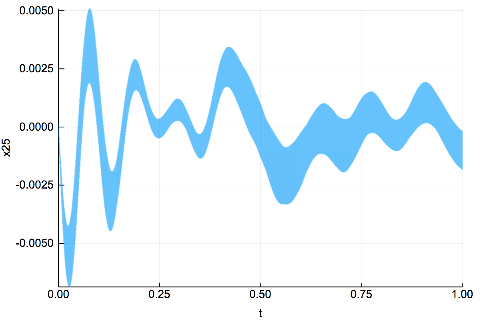

# ReachabilityBenchmarks

This is a benchmark suite for reach set computations. It includes the [SLICOT](http://slicot.org/20-site/126-benchmark-examples-for-model-reduction) models, which reflect real world applications with dimensions ranging from several dozens to over 10.000. 

## Installation

Clone this repository

```
git clone https://github.com/JuliaReach/ReachabilityBenchmarks.git
```

You need to have installed the Julia package [Reachability.jl](https://github.com/JuliaReach/Reachability.jl),
by following the instruction in the [installation section](https://github.com/JuliaReach/Reachability.jl#installing).

The models stored in MAT files are loaded using the [MAT.jl](https://github.com/JuliaIO/MAT.jl) Julia package.

There are also bash scripts to run [SpaceEx](http://spaceex.imag.fr/) for most of the models.
These scripts assume that `spaceex` (and some other tools for creating plots) are added to the PATH.

## Usage

The models are given as Julia scripts, which you can run by including them in
Julia's REPL, e.g.

```julia
julia> include("models/SLICOT/iss/iss.jl")
```

The scripts are accompanied by a function named like the model, which calculates
reachable states or checks a safety property, depending on the model's options.
To compute the reach set using the default options with a time step of 0.01, do

```julia
julia> sol = solve(iss(:mode=>"reach", :T=>20.0, :δ=>0.01));
```

More options can be added in the same style.

To plot the reachable states, you can use the function `plot` from the `Plots`
package.

```julia
julia> using Plots

julia> plot(sol)
```

## Running all the benchmarks

This repository provides a Julia script that will execute Julia on all existent
[SLICOT](http://slicot.org/20-site/126-benchmark-examples-for-model-reduction) models.
```bash
julia -e 'include("src/benchmark_all.jl")'
```
The results are stored in the current folder.
There is also a bash script which can be modified (by just uncommenting the
respective parts) to run SpaceEx on all the models.

## Exploring the tutorial notebooks

Follow [this Jupyter nbviewer link](https://nbviewer.jupyter.org/github/JuliaReach/ReachabilityBenchmarks/tree/master/models/) to access the folder of available models, and click on files of type ".ipynb" to open the notebooks.

For example, in [models/ARCH2018/SpaceStation](https://nbviewer.jupyter.org/github/JuliaReach/ReachabilityBenchmarks/blob/master/models/ARCH2018/SpaceStation/ISS.ipynb) you will find a safety property check for the 270-variable structural model of component 1R (Russian service module) of the International Space Station.

## Screenshots




